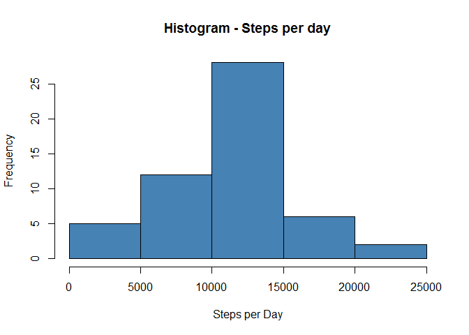
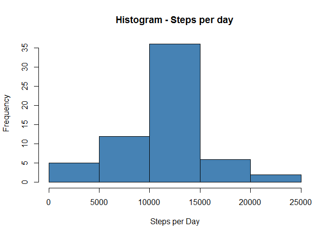

# Reproducible Research: Peer Assessment 1


## Loading and preprocessing the data

```r
library(ggplot2)
rawdata<-read.csv("activity.csv")
data<-rawdata
data$date<-as.Date(data$date)
```

## What is mean total number of steps taken per day?

```r
data<-data[!is.na(data$steps),]
dates<-unique(data$date)
daysteps<-numeric()
for(i in 1:length(dates)){
  daysteps[i]<-sum(data$steps[data$date==dates[i]])
}
hist(daysteps,main="Histogram - Steps per day",xlab="Steps per Day",col="steelblue")
```

 

```r
meansteps<-mean(daysteps)
mediansteps<-median(daysteps)
```
I am ignoring the dates that have no data and removing those dates from the dataset
The mean (average number of steps per day) is **1.0766 &times; 10<sup>4</sup>** and the median is **1.0765 &times; 10<sup>4</sup>**


## What is the average daily activity pattern?

```r
intervals<-unique(data$interval)
dailyPattern<-tapply(data$steps,data$interval,mean)
plot(intervals,dailyPattern,type="l",ylab="Average number of Steps",xlab="Interval",main="Daily Activity Pattern")
```

 

```r
max_index<-which.max(dailyPattern)
max_interval<-intervals[max_index]
```
The interval **835** contains the maximum number of steps in average?


## Imputing missing values

```r
data<-rawdata
data$date<-as.Date(data$date)
missingValues<-sum(is.na(data$steps))
missingValueIndex<-which(is.na(data$steps))
for(i in 1:missingValues){
  data$steps[missingValueIndex[i]]<-dailyPattern[as.character(data$interval[missingValueIndex[i]])]
}
```
There are **2304** missing values on this dataset  
Each NA value is replaced with the mean of the 5 minute interval

```r
daysteps<-numeric()
dates<-unique(data$date)
for(i in 1:length(dates)){
  daysteps[i]<-sum(data$steps[data$date==dates[i]])
}
hist(daysteps,main="Histogram - Steps per day",xlab="Steps per Day",col="steelblue")
```

 

```r
meansteps<-mean(daysteps)
mediansteps<-median(daysteps)
```
Now the mean (average number of steps per day) is **1.0766 &times; 10<sup>4</sup>** and the median is **1.0766 &times; 10<sup>4</sup>**  
The values change a little because we are changing the dataset adding new values
Evidently inputing missing data into the dataset changes things, but since the criteria is not aggressive, the differenced is very small

## Are there differences in activity patterns between weekdays and weekends?

```r
Sys.setlocale("LC_TIME", "English")
```

```
## [1] "English_United States.1252"
```

```r
day<-numeric()
for(i in 1:length(data$date)){
  if(weekdays(data$date[i])=="Saturday" || weekdays(data$date[i])=="Sunday")
    day[i]<-1
  else
    day[i]<-0
}

day<-factor(day,labels=c("weekday","weekend"))
data[,4]<-day
names(data)[4]<-"day"
ggplot(data,aes(interval,steps))+facet_grid(.~day)+ stat_summary(fun.y="mean", geom="line")
```

 
